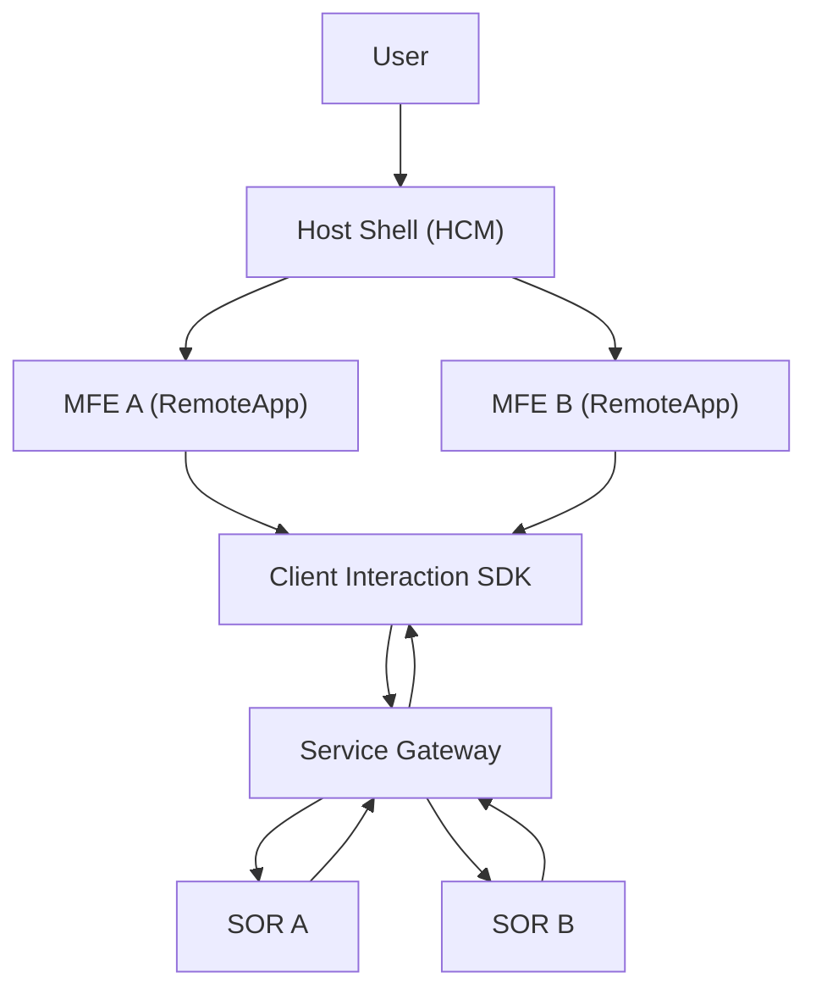

```mermaid
flowchart TD
  U["User"] --> H["Host Shell (HCM)"]

  H --> A["MFE A (RemoteApp)"]
  H --> B["MFE B (RemoteApp)"]

  A --> SDK["Client Interaction SDK"]
  B --> SDK

  SDK --> GW["Service Gateway"]

  GW --> SORA["SOR A"]
  GW --> SORB["SOR B"]

  SORA --> GW
  SORB --> GW

  GW --> SDK
```