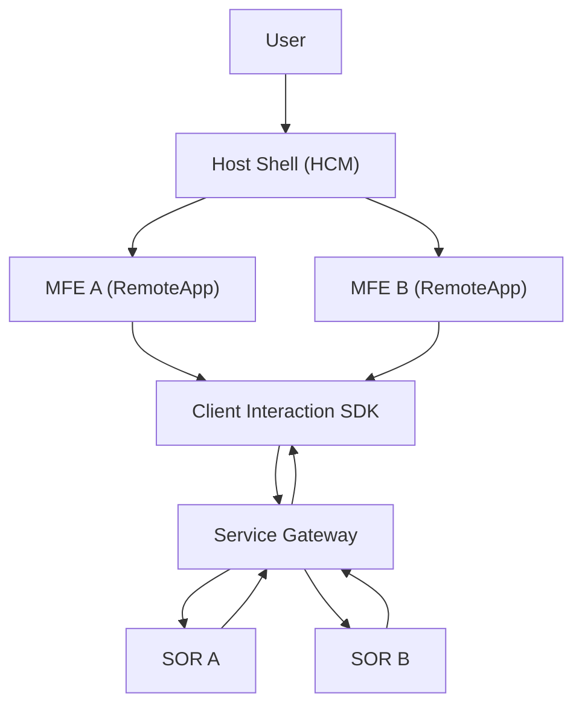
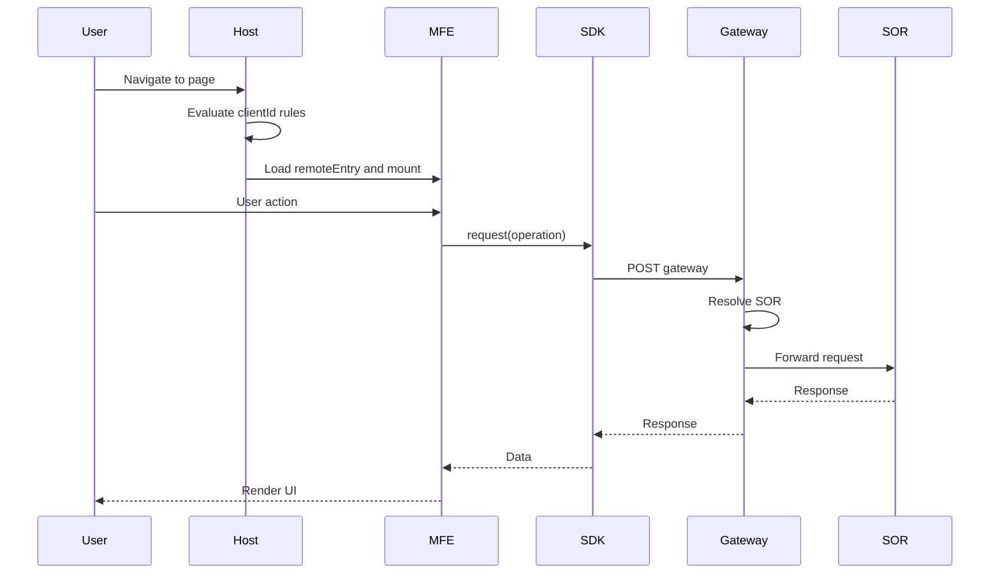

## Micro-Frontend Proof of Concept

This repository contains a **Micro-Frontend Proof of Concept** demonstrating **runtime composition** using a **Host Shell** and **independently deployed remotes**, inspired by real-world **enterprise architectures**.

The Host dynamically decides which Micro-Frontend to render at runtime, while each MFE is built and deployed independently. This setup reflects common enterprise patterns such as Host-driven composition, runtime module federation, and clear separation of responsibilities between the container and the remotes.

## Flow Diagram:

## Sequence Diagram
