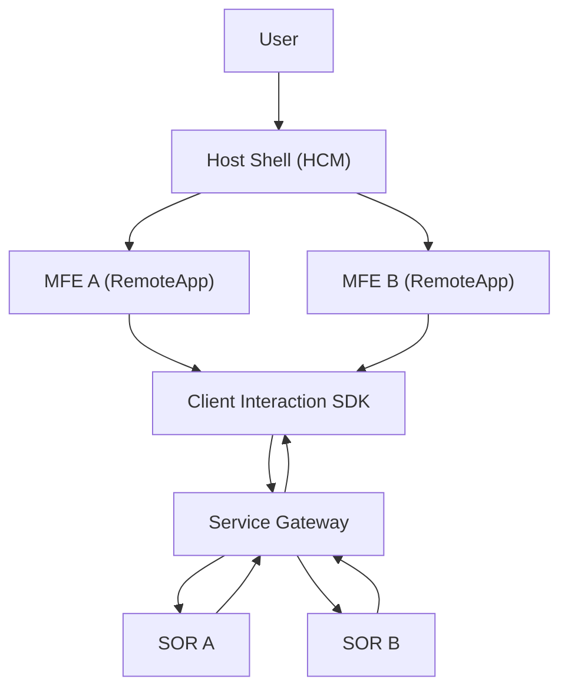
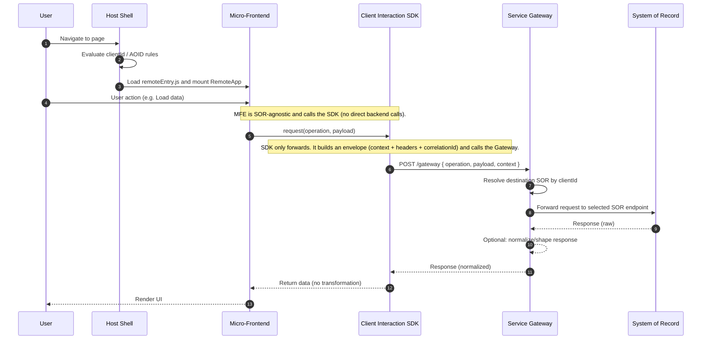

## Micro-Frontend Proof of Concept

This repository contains a **Micro-Frontend Proof of Concept** demonstrating **runtime composition** using a **Host Shell** and **independently deployed remotes**, inspired by real-world **enterprise architectures**.

The Host dynamically decides which Micro-Frontend to render at runtime, while each MFE is built and deployed independently. This setup reflects common enterprise patterns such as Host-driven composition, runtime module federation, and clear separation of responsibilities between the container and the remotes.

## Architecture

The system is composed of the following layers:

- **Host Shell (HCM)**  
  Responsible for routing, client-based gating, and deciding which MFE is
  rendered at runtime.

- **Micro-Frontends (MFEs)**  
  Independently built and deployed UI modules. MFEs are SOR-agnostic and never
  call backend systems directly.

- **Client Interaction SDK**  
  A shared SDK used by MFEs to request data or execute operations. The SDK only
  forwards requests and does not process business data.

- **Service Gateway**  
  Backend routing layer responsible for resolving the correct System of Record
  based on client context.

- **Systems of Record (SORs)**  
  Authoritative backend systems that own and serve domain data.

## Project Structure
```text
mfe-lab/
├─ apps/
│  ├─ host/                  # Host Shell (Vite + React)
│  ├─ mfe-a/                 # Micro-Frontend A (Remote)
│  ├─ mfe-b/                 # Micro-Frontend B (Remote)
│  ├─ service-gateway/       # Service Gateway (Node + Express)
│  ├─ sor-a/                 # Mock System of Record A
│  └─ sor-b/                 # Mock System of Record B
└─ packages/
   └─ client-interaction-sdk/  # Shared SDK used by MFEs
```

## Local Setup

### Backend services
Run each backend service in a separate terminal:

```bash
npm run dev -w apps/sor-a
npm run dev -w apps/sor-b
npm run dev -w apps/service-gateway
```
### Micro-Frontends
Each Micro-Frontend is built and served using Vite preview:
```bash
npm run start -w apps/mfe-a
npm run start -w apps/mfe-b
```
### Host Shell
Run the Host Shell in development mode:
```bash
npm run dev -w apps/host
```
## Runtime Flow

1. The user navigates to a page in the Host Shell.
2. The Host evaluates client-based rules and decides which MFE to load.
3. The selected MFE is loaded dynamically via Module Federation.
4. User interactions inside the MFE trigger calls to the Client Interaction SDK.
5. The SDK forwards requests to the Service Gateway with the required context.
6. The Service Gateway resolves the appropriate System of Record.
7. The SOR processes the request and returns the response.
8. Data flows back to the MFE, which renders the UI.

## Flow Diagram


## Sequence Diagram


## Notes & Limitations

- This repository is implemented as a **monorepo** for simplicity and learning purposes.
- In a real-world production setup, the **Host Shell, each Micro-Frontend, the SDK, the Gateway, and each System of Record would typically live in separate repositories** and be built and deployed independently.
- Client identity, authorization, and roles are currently hardcoded to simplify the flow.
- Backend services are mock implementations and do not represent production-ready systems.
- Routing logic inside the Service Gateway is static and configuration-based.
- This POC focuses on **architectural flow and responsibilities**, not on production hardening, security, or scalability.

### Out of Scope

This architecture intentionally omits:

- Authentication and authorization enforcement
- Dynamic configuration services
- Observability and tracing infrastructure
- Production-grade error handling

These concerns are out of scope for this POC and would be added incrementally
in a real-world implementation.

